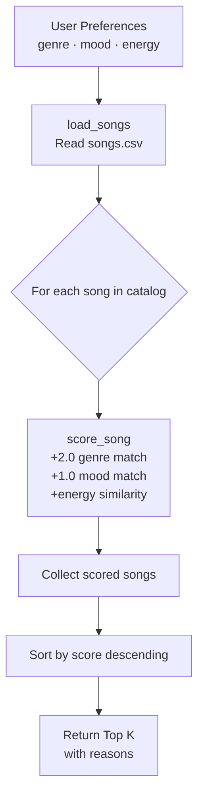

# 🎵 Music Recommender Simulation

## Project Summary

In this project you will build and explain a small music recommender system.

This project builds a simple music recommender system that suggests songs based on a user's preferred "vibe." It uses a content-based filtering approach, meaning it compares song features like genre, mood, energy, and tempo to a user’s preferences. Each song is scored based on how similar it is to the user’s taste, and the highest scoring songs are recommended. This simulation helps demonstrate how real-world platforms personalize music recommendations.

---

## How The System Works

This system uses a content-based recommendation approach to suggest songs.

Each song in `data/songs.csv` has these features:
- **Genre** — musical category (pop, lofi, rock, hip-hop, etc.)
- **Mood** — emotional tone (happy, chill, intense, relaxed, melancholic, etc.)
- **Energy** — intensity level on a 0.0–1.0 scale
- **Tempo (BPM)** — beats per minute
- **Valence** — positivity on a 0.0–1.0 scale
- **Danceability** — rhythmic suitability on a 0.0–1.0 scale
- **Acousticness** — acoustic vs. electronic on a 0.0–1.0 scale

### Algorithm Recipe

Each song receives a score calculated as follows:

| Criterion | Points |
|---|---|
| Genre matches user preference | +2.0 |
| Mood matches user preference | +1.0 |
| Energy similarity: `1.0 - abs(song_energy - user_energy)` | 0.0 – 1.0 |
| **Maximum possible score** | **4.0** |

Songs are then ranked from highest to lowest score; the top K are returned as recommendations.

**Potential bias:** Genre is weighted twice as heavily as mood, so two songs that match the mood but differ in genre will score differently even if they feel similar. A metal song and a pop song both tagged "intense" are not interchangeable to this system.

### Data Flow


---

## Getting Started

### Setup

1. Create a virtual environment (optional but recommended):

   ```bash
   python -m venv .venv
   source .venv/bin/activate      # Mac or Linux
   .venv\Scripts\activate         # Windows

2. Install dependencies

```bash
pip install -r requirements.txt
```

3. Run the app:

```bash
python -m src.main
```

### Running Tests

Run the starter tests with:

```bash
pytest
```

You can add more tests in `tests/test_recommender.py`.

---

## Experiments You Tried

- Increasing the weight of genre made the recommendations more consistent in style but less diverse.
- Lowering the genre weight allowed more variety but sometimes produced less relevant results.
- Adding valence improved recommendations for mood-based users (e.g., happy vs sad).
- Including tempo helped differentiate between calm and fast-paced songs.

---

## Limitations and Risks

Summarize some limitations of your recommender.

- The system only uses a small dataset, so recommendations are limited.
- It does not consider lyrics, artist popularity, or listening context.
- It may over-prioritize certain features like genre and ignore others.
- All users are treated similarly, even though real preferences are more complex.

---

## Reflection

Read and complete `model_card.md`:

[**Model Card**](model_card.md)

Write 1 to 2 paragraphs here about what you learned:

This project helped me understand how recommender systems turn user preferences into numerical scores to make predictions. I learned that even simple rules can produce useful recommendations, but they also have limitations.

It also showed me how bias can appear in systems like this. For example, if the dataset is limited or certain features are weighted too heavily, the system may favor certain types of music and ignore others. This reflects real-world challenges in building fair and balanced recommendation systems.


---

## 7. `model_card_template.md`

Combines reflection and model card framing from the Module 3 guidance. :contentReference[oaicite:2]{index=2}  

```markdown
# 🎧 Model Card - Music Recommender Simulation

## 1. Model Name

Give your recommender a name, for example:

> VibeFinder 1.0

---

## 2. Intended Use

- What is this system trying to do
- Who is it for

Example:

> This model suggests 3 to 5 songs from a small catalog based on a user's preferred genre, mood, and energy level. It is for classroom exploration only, not for real users.

---

## 3. How It Works (Short Explanation)

Describe your scoring logic in plain language.

- What features of each song does it consider
- What information about the user does it use
- How does it turn those into a number

Try to avoid code in this section, treat it like an explanation to a non programmer.

---

## 4. Data

Describe your dataset.

- How many songs are in `data/songs.csv`
- Did you add or remove any songs
- What kinds of genres or moods are represented
- Whose taste does this data mostly reflect

---

## 5. Strengths

Where does your recommender work well

You can think about:
- Situations where the top results "felt right"
- Particular user profiles it served well
- Simplicity or transparency benefits

---

## 6. Limitations and Bias

Where does your recommender struggle

Some prompts:
- Does it ignore some genres or moods
- Does it treat all users as if they have the same taste shape
- Is it biased toward high energy or one genre by default
- How could this be unfair if used in a real product

---

## 7. Evaluation

How did you check your system

Examples:
- You tried multiple user profiles and wrote down whether the results matched your expectations
- You compared your simulation to what a real app like Spotify or YouTube tends to recommend
- You wrote tests for your scoring logic

You do not need a numeric metric, but if you used one, explain what it measures.

---

## 8. Future Work

If you had more time, how would you improve this recommender

Examples:

- Add support for multiple users and "group vibe" recommendations
- Balance diversity of songs instead of always picking the closest match
- Use more features, like tempo ranges or lyric themes

---

## 9. Personal Reflection

A few sentences about what you learned:

- What surprised you about how your system behaved
- How did building this change how you think about real music recommenders
- Where do you think human judgment still matters, even if the model seems "smart"

