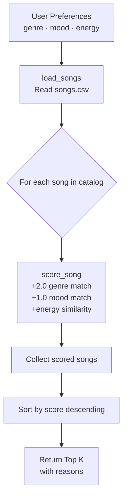

# 🎵 Music Recommender Simulation

## Project Summary

In this project you will build and explain a small music recommender system.

This project builds a simple music recommender system that suggests songs based on a user's preferred "vibe." It uses a content-based filtering approach, meaning it compares song features like genre, mood, energy, and tempo to a user’s preferences. Each song is scored based on how similar it is to the user’s taste, and the highest scoring songs are recommended. This simulation helps demonstrate how real-world platforms personalize music recommendations.

---

## How The System Works

This system uses a content-based recommendation approach to suggest songs.

Each song in `data/songs.csv` has these features:
- **Genre** — musical category (pop, lofi, rock, hip-hop, etc.)
- **Mood** — emotional tone (happy, chill, intense, relaxed, melancholic, etc.)
- **Energy** — intensity level on a 0.0–1.0 scale
- **Tempo (BPM)** — beats per minute
- **Valence** — positivity on a 0.0–1.0 scale
- **Danceability** — rhythmic suitability on a 0.0–1.0 scale
- **Acousticness** — acoustic vs. electronic on a 0.0–1.0 scale

### Algorithm Recipe

Each song receives a score calculated as follows:

| Criterion | Points |
|---|---|
| Genre matches user preference | +2.0 |
| Mood matches user preference | +1.0 |
| Energy similarity: `1.0 - abs(song_energy - user_energy)` | 0.0 – 1.0 |
| **Maximum possible score** | **4.0** |

Songs are then ranked from highest to lowest score; the top K are returned as recommendations.

**Potential bias:** Genre is weighted twice as heavily as mood, so two songs that match the mood but differ in genre will score differently even if they feel similar. A metal song and a pop song both tagged "intense" are not interchangeable to this system.

### Data Flow


---

## Getting Started

### Setup

1. Create a virtual environment (optional but recommended):

   ```bash
   python -m venv .venv
   source .venv/bin/activate      # Mac or Linux
   .venv\Scripts\activate         # Windows

2. Install dependencies

```bash
pip install -r requirements.txt
```

3. Run the app:

```bash
python -m src.main
```

### Running Tests

Run the starter tests with:

```bash
pytest
```

You can add more tests in `tests/test_recommender.py`.

---

## Experiments You Tried

Four user profiles were stress-tested. Terminal output for each is shown below.

**Profile 1 — High-Energy Pop** (`genre=pop, mood=happy, energy=0.9`)
```
Sunrise City [pop / happy]        Score: 3.92
Gym Hero [pop / intense]          Score: 2.97
Rooftop Lights [indie pop/happy]  Score: 1.86
Storm Runner [rock / intense]     Score: 0.99
Block Party Anthem [hip-hop]      Score: 0.97
```
Sunrise City is the obvious winner. Gym Hero ranked 2nd despite its "intense" mood because the genre bonus (2.0) outweighs the missing mood point (1.0). A strict "happy pop only" listener would likely skip it.

---

**Profile 2 — Chill Lofi** (`genre=lofi, mood=chill, energy=0.35`)
```
Library Rain [lofi / chill]       Score: 4.00  ← perfect score
Midnight Coding [lofi / chill]    Score: 3.93
Focus Flow [lofi / focused]       Score: 2.95
Spacewalk Thoughts [ambient]      Score: 1.93
Coffee Shop Stories [jazz]        Score: 0.98
```
The cleanest result. When genre coverage in the dataset is good, the scorer works exactly as intended — three lofi songs in a row, all making intuitive sense.

---

**Profile 3 — Deep Intense Rock** (`genre=rock, mood=intense, energy=0.95`)
```
Storm Runner [rock / intense]     Score: 3.96
Ironclad [metal / intense]        Score: 1.99
Gym Hero [pop / intense]          Score: 1.98
Festival Drop [edm / euphoric]    Score: 1.00
Block Party Anthem [hip-hop]      Score: 0.92
```
Storm Runner wins by a huge margin (only rock song in the catalog). Metal and Pop both tied at ~1.99 on mood + energy alone — the system could not separate them by genre.

---

**Profile 4 (Adversarial) — Jazz + Euphoric + High Energy** (`genre=jazz, mood=euphoric, energy=0.9`)
```
Coffee Shop Stories [jazz/relaxed]  Score: 2.47  ← genre bias
Festival Drop [edm / euphoric]      Score: 1.95
Storm Runner [rock / intense]       Score: 0.99
Gym Hero [pop / intense]            Score: 0.97
Block Party Anthem [hip-hop]        Score: 0.97
```
The clearest example of genre-weight bias. Coffee Shop Stories is a slow, relaxed café jazz track — the opposite of "high-energy euphoric" — yet it ranked first because its genre tag earned +2.0 points. Festival Drop, which is genuinely euphoric and high-energy, scored 0.52 points less.

---

**Experiment — halve genre weight, double energy weight** (adversarial profile)
```
Festival Drop [edm / euphoric]      Score: 2.90  ← bias corrected
Storm Runner [rock / intense]       Score: 1.98
Gym Hero [pop / intense]            Score: 1.94
Coffee Shop Stories [jazz/relaxed]  Score: 1.94  ← demoted to 4th
Block Party Anthem [hip-hop]        Score: 1.94
```
Reducing genre from +2.0 to +1.0 and doubling the energy contribution moved Festival Drop to first place — a much better result for this user. The downside: well-matched profiles like Chill Lofi lose some precision because genre now matters less throughout the system.

---

## Limitations and Risks

Summarize some limitations of your recommender.

- The system only uses a small dataset, so recommendations are limited.
- It does not consider lyrics, artist popularity, or listening context.
- It may over-prioritize certain features like genre and ignore others.
- All users are treated similarly, even though real preferences are more complex.

---

## Reflection

Full model card: [model_card.md](model_card.md)

**Biggest learning moment:** Seeing a slow, relaxed jazz café track rank first for a user who asked for high-energy euphoric jazz. The algorithm followed its rules perfectly — genre was worth the most points, so the only jazz song won. The code was correct; the result was wrong. That gap between "the math checks out" and "the output is actually useful" is something I hadn't expected to feel so clearly from such a small program. It made algorithmic bias tangible rather than theoretical.

**On using AI tools:** AI assistance accelerated the boilerplate — the CSV loading, the `sorted()` pattern, the energy-similarity formula. But it couldn't tell me whether my *design decisions* were good. The adversarial profile test (which I had to run myself) was what revealed that a genre weight of 2.0 would dominate every scenario where genre and energy conflicted. AI tools are strong on structure and syntax; only running the system on real inputs shows whether the logic does what you actually intended.

**What surprised me about simple algorithms feeling like recommendations:** I expected three scoring rules to feel obviously mechanical. What surprised me is how convincing it felt when the top result matched intuition — Library Rain scoring a perfect 4.0 for the Chill Lofi profile felt like the system *understood* the user. That feeling was produced by one dictionary lookup, one string comparison, and one subtraction. It helped me understand why people trust recommendation systems without questioning them: the system doesn't need to be complex to feel smart, it just needs to be right often enough.

**What I'd try next:** Replace binary genre matching (2 points or 0) with a genre-similarity table so metal and rock are treated as closer neighbors than metal and lofi. Also add valence to the scoring formula — it captures positive vs. negative emotional tone independently of energy, which would fix the "calm but sad vs. calm but happy" blind spot the current system has.


---

## 7. `model_card_template.md`

Combines reflection and model card framing from the Module 3 guidance. :contentReference[oaicite:2]{index=2}  

```markdown
# 🎧 Model Card - Music Recommender Simulation

## 1. Model Name

Give your recommender a name, for example:

> VibeFinder 1.0

---

## 2. Intended Use

- What is this system trying to do
- Who is it for

Example:

> This model suggests 3 to 5 songs from a small catalog based on a user's preferred genre, mood, and energy level. It is for classroom exploration only, not for real users.

---

## 3. How It Works (Short Explanation)

Describe your scoring logic in plain language.

- What features of each song does it consider
- What information about the user does it use
- How does it turn those into a number

Try to avoid code in this section, treat it like an explanation to a non programmer.

---

## 4. Data

Describe your dataset.

- How many songs are in `data/songs.csv`
- Did you add or remove any songs
- What kinds of genres or moods are represented
- Whose taste does this data mostly reflect

---

## 5. Strengths

Where does your recommender work well

You can think about:
- Situations where the top results "felt right"
- Particular user profiles it served well
- Simplicity or transparency benefits

---

## 6. Limitations and Bias

Where does your recommender struggle

Some prompts:
- Does it ignore some genres or moods
- Does it treat all users as if they have the same taste shape
- Is it biased toward high energy or one genre by default
- How could this be unfair if used in a real product

---

## 7. Evaluation

How did you check your system

Examples:
- You tried multiple user profiles and wrote down whether the results matched your expectations
- You compared your simulation to what a real app like Spotify or YouTube tends to recommend
- You wrote tests for your scoring logic

You do not need a numeric metric, but if you used one, explain what it measures.

---

## 8. Future Work

If you had more time, how would you improve this recommender

Examples:

- Add support for multiple users and "group vibe" recommendations
- Balance diversity of songs instead of always picking the closest match
- Use more features, like tempo ranges or lyric themes

---

## 9. Personal Reflection

A few sentences about what you learned:

- What surprised you about how your system behaved
- How did building this change how you think about real music recommenders
- Where do you think human judgment still matters, even if the model seems "smart"

